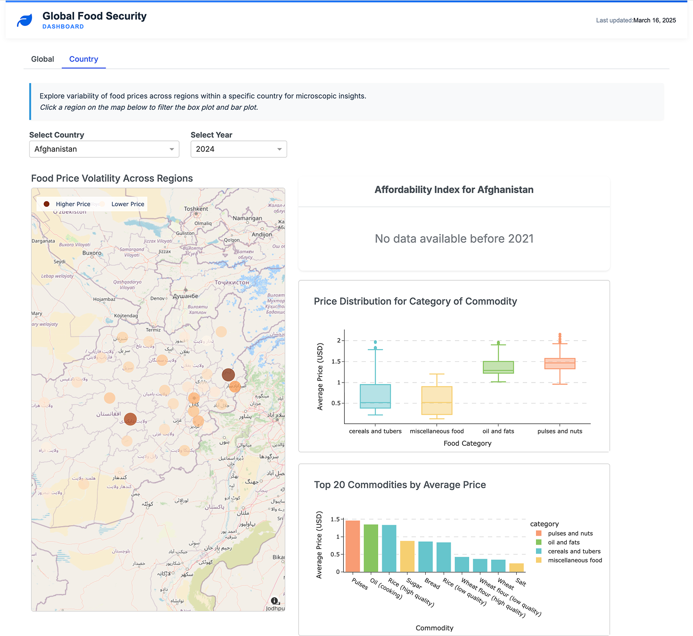

# Food Security Dashboard

## Overview
This dashboard provides insights into global food security by monitoring key metrics in developing countries, including food prices, affordability, and undernourishment. By visualizing data across time and location, users can easily pinpoint areas that may require additional support and prioritize commodities for aid programs.

## Motivation and Purpose
Food security and supply are fundamental to human survival, but many developing countries still face food shortages and insecurity. NGOs work to enhance food security through various programs, while policymakers develop policies to improve food supply in these regions. Our goal is to provide data-driven support for NGOs and policymakers to optimize decision-making and resource allocation. To achieve this, we have developed a dashboard that monitors food conditions in developing countries in real time, including key indicators such as food trends, affordability, and price fluctuations. This tool helps identify the regions that need assistance and enables the design and implementation of more effective food aid programs or policies.

## Features
- **Global Overview Tab:** Displays food pricing and malnutrition trends over time. Users can compare multiple countries and filter specific food categories.
- **Country Analysis Tab:** Provides detailed insights into regional food security, price instability, and commodity rankings within a selected country.
- **Interactive Visualizations:** Allows users to explore food security metrics dynamically with time filters, dropdown selections, and hover details.
- **Data-Driven Decision Support:** Helps policymakers and aid organizations identify priority areas and allocate resources efficiently.

## Data Sources
The dataset used in this project is the [Global Food Prices](https://data.humdata.org/dataset/global-wfp-food-prices) dataset from the World Food Programme, containing approximately 300,000 records of monthly food prices across 98 developing countries and 3,000 markets from January 1990 to February 2025. Key variables include the date of the record, market location (city with latitude/longitude), food category (e.g., cereals, oils, tubers), specific food item, local currency, price, and price in USD.

Additionally, we incorporate:
- **Adjusted Net National Income per Capita (US$)** from the past ten years, sourced from the [World Development Indicators](https://databank.worldbank.org/source/world-development-indicators), to assess food affordability per country.
- **Prevalence of Undernourishment** over the past twenty years, sourced from the [Food and Agriculture Organization](https://www.fao.org/faostat/en/#data/FS), to contextualize food security trends.

## Installation
Ensure you have **Python 3.11+** installed. Then, install the required dependencies using:

```bash
pip install pandas altair plotly dash dash-bootstrap-components
```

## Running the Dashboard
To start the dashboard, run the following command:

```bash
python src/app.py
```

The dashboard will be accessible at:

```
http://127.0.0.1:8050/
```

## Project Structure
```
.
├── src/
│   ├── app.py  # Main application file
│   ├── data.py # Module for data processing
│   ├── plot.py # Module for plotting
│   └── callback.py # Module for callback funtions
├── data/        # Directory for dataset
├── README.md    # Project documentation
└── .gitignore   # Git ignore file
```

## Usage Scenarios
### Example: Aid Organization Planning
Ann, a staff member at the World Food Programme (WFP), is preparing a proposal for a food aid project. She needs insights into food security across developing countries, including affordability, price fluctuations, and demand trends. Using the dashboard, she can:
1. Identify the countries most affected by food insecurity.
2. Analyze regional price disparities and affordability metrics.
3. Compare commodity price stability and detect seasonal trends.
4. Make data-driven recommendations for food aid interventions.

## Research Questions
The dashboard helps answer key questions such as:
- Which countries struggle the most with food affordability?
- How have food prices changed over the years?
- Which countries have seen the fastest price increases?
- Which regions within countries are the most vulnerable?
- How much do prices vary within food categories and across locations?
- Which commodities exhibit the most unstable pricing trends?

## Dashboard Output



## Contribution
Feel free to fork this repository and submit pull requests for improvements.

## License
This project is open-source and available under the MIT License.


